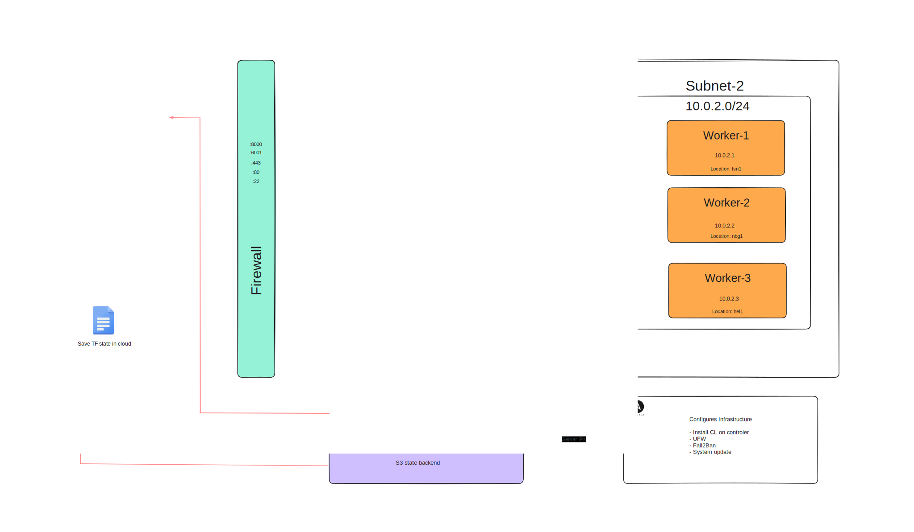

# Self hosting infrastructure cluster

Infra for utilizing Hetzner low-cost VPS and Docker containers, wrapped in [Coolify](https://coolify.io) as an all-in-one PaaS, to self-host your own applications, databases, or services.

## Prerequisites

Before you begin, ensure you have the following:

- [Hetzner Cloud account](https://hetzner.cloud/?ref=Ix9xCKNxJriM)
- [Terraform](https://www.terraform.io/downloads.html)
- [Ansible](https://docs.ansible.com/ansible/latest/installation_guide/intro_installation.html)

This second iteration offers more granular control over the infrastructure that is created.
It abstracts components into modules that can be reused and imported as source.

Benefits include the ability to change infrastructure components in place, targeting specific components.
For example, in earlier iterations, you might not have known which server would be destroyed.

Terraform modules have been moved to separate ***[repository](https://github.com/Ujstor/terraform-hetzner-modules)*** that contain Hetzner Cloud and Cloudflare resources, and they are referenced through source and release.

Old code is available in the [old_config branch](https://github.com/Ujstor/self-hosting-infrastructure-cluster/tree/old_config)

***Check [docs](ujstor.github.io/self-hosting-infrastructure-cluster) for more detailed info.*** 
