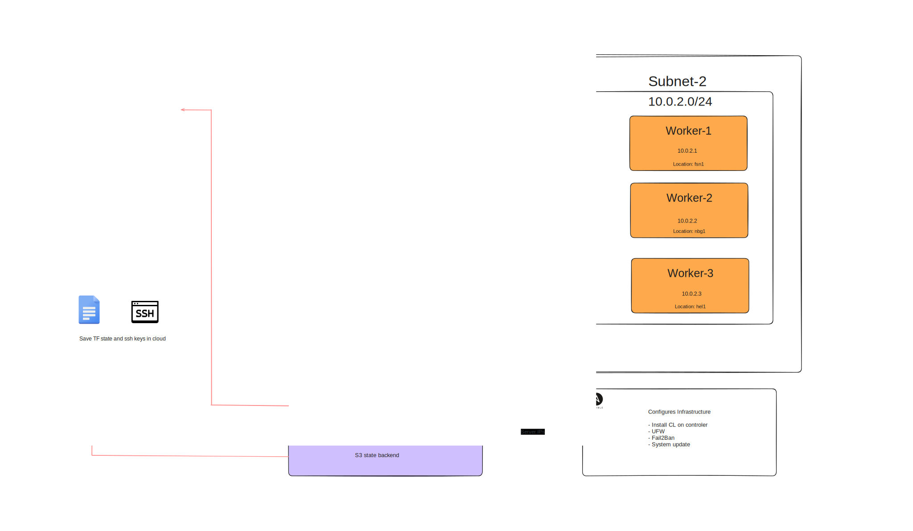

# Self hosting infrastructure cluster

Infra for utilizing Hetzner low-cost VPS and Docker containers, wrapped in [Coolify](https://coolify.io) as an all-in-one PaaS, to self-host your own applications, databases, or services.

## Prerequisites

Before you begin, ensure you have the following:

- [Hetzner Cloud account](https://hetzner.cloud/?ref=Ix9xCKNxJriM) 
- [Terraform](https://www.terraform.io/downloads.html)
- [Ansible](https://docs.ansible.com/ansible/latest/installation_guide/intro_installation.html)
